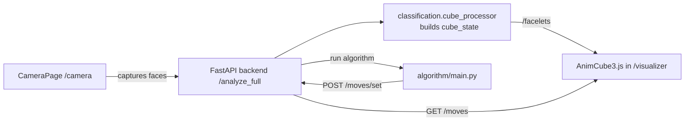

## Rubix – Camera‑driven Rubik’s Cube Visualizer and Solver

Modern web app for scanning a real cube, visualizing it in 3D with AnimCubeJS, and stepping through a solver’s move sequence with sleek custom controls.

### Key Highlights
- **Camera capture → Backend processing → Live 3D playback**: end‑to‑end flow from images to facelets to animated moves.
- **AnimCubeJS, reimagined**: legacy controls hidden; custom Play/Pause/Prev/Next/Reset, move counter, zoom, snap, and premium fullscreen UI.
- **Consistent orientations**: dedicated facelet generator endpoint; algorithm‑specific rotations applied in the algorithm, not during capture.
- **Single source of truth**: frontend pulls `facelets` from backend; moves come from backend `moves_made` for accuracy.
- **Playground = Visualizer**: the new visualizer is the React/TSX port of the HTML playground with pixel‑perfect parity and UX improvements.

---

## Architecture



### Repos and key paths
- `cube-visualizer/` – Next.js app (React/TSX, Tailwind)
  - Routes: `/camera`, `/visualizer` (re-exports `/playground`)
  - Custom AnimCubeJS integration and UI live in `app/playground/page.tsx`
- `server.py` – FastAPI backend (Uvicorn)
  - Core endpoints: `/analyze_full`, `/facelets`, `/moves`, `/moves/set`, `/moves/clear`
- `classification/` – image processing and cube state assembly
  - `cube_processor.py` exposes `get_cube_state()`; exports raw state and txt when asked
- `algorithm/` – Python solver, move tracking and translations
  - `algorithm.py` applies algorithm‑specific source transformations
  - `controls.py` tracks moves; `export_moves()` returns `moves_made` and translated `moves_animcube`
  - `main.py` orchestrates loading state and running the solver

---

## Getting Started

### Prerequisites
- Node.js 18+ and pnpm (or npm/yarn)
- Python 3.11+

### 1) Backend (FastAPI)
```bash
cd /Users/santoshkota/Documents/rubix
python3 -m venv .venv
source .venv/bin/activate
pip install fastapi uvicorn numpy scikit-learn opencv-python
uvicorn server:app --reload --host 0.0.0.0 --port 8001
```

Backend now serves endpoints at `http://localhost:8001`.

### 2) Frontend (Next.js)
```bash
cd /Users/santoshkota/Documents/rubix/cube-visualizer
pnpm install
pnpm dev
```

Open `http://localhost:3000`.

---

## Core Flows

### Capture & Analyze
1. Go to `/camera` and capture all 6 faces.
2. Press “Analyze Cube”.
   - Backend validates and exports raw cube state (txt for legacy visualizer) and runs the solver.
   - Solver posts moves back to backend.
3. You’re redirected to `/visualizer`.

### Visualize & Learn
- `/visualizer` loads:
  - `facelets` from `GET /facelets` (fallback to `sessionStorage.animcube_facelets`)
  - move sequence from `GET /moves` (`moves_made` preferred)
- Custom controls drive AnimCubeJS via direct access API:
  - `acjs_getMove`, `acjs_move`, `acjs_startAnimation`, `acjs_pauseAnimation`, `acjs_stopAnimation`, `acjs_clear`, `acjs_put_var`, `acjs_get_var`, `acjs_paint`
- Fullscreen uses the browser Fullscreen API and sets AnimCube internal `size` dynamically to fit the viewport while keeping the toolbar visible.

---

## API Reference (selected)

- `GET /facelets`
  - Returns `{ success, facelets }` where `facelets` is a 54‑char string for AnimCubeJS.
- `GET /moves`
  - Returns `{ moves, moves_made, moves_animcube, count }`.
- `POST /moves/set`
  - Sets moves from the solver; body: `{ moves_made: string[] }` (plus optional fields).
- `POST /moves/clear`
  - Clears stored moves.
- `POST /analyze_full`
  - Orchestrates: persists cube data, exports txt to expected paths, runs `algorithm/main.py`, and ingests results.

---

## Orientation & Data Contracts

### Facelets
- `classification.cube_processor` keeps `cube_state` raw (no per-face rotations),
- `server.cube_state_to_facelets(state)` maps that to a deterministic 54‑char facelet string for AnimCubeJS (no transforms).

### Algorithm
- Algorithm’s internal expectations are met by applying per‑face transforms inside `algorithm/algorithm.py` (e.g., rotate U, L; mirror D; etc.).
- `controls.translate_move()` converts the algorithm’s notation to what AnimCube expects; frontend consumes `moves_made` directly.

---

## Development Notes

### AnimCubeJS Integration
- Loaded from CDN: `https://cdn.jsdelivr.net/gh/cubing/AnimCubeJS/AnimCube3.js`
- Hidden defaults: `buttonbar=0` with `listen=1`, `counter=1`, `perspective=2`, `snap=1`, `align=1`.
- Fullscreen sizing:
  - Compute available square = `min(viewportWidth, viewportHeight - toolbarHeight)`.
  - Apply internal size: `acjs_put_var(id, 'size', px, 'n'); acjs_paint(id)`.
- Stepping and Play:
  - Parse each token with `acjs_getMove`, push to `acjs_move[id][0]`, start with `acjs_startAnimation(id)(0)`.
  - Poll `acjs_get_var(id)('animating')` to detect end and update counter.

### Frontend commands
```bash
# from project root
cd cube-visualizer
pnpm dev              # start frontend
pnpm build && pnpm start  # production
```

### Backend commands
```bash
uvicorn server:app --reload --host 0.0.0.0 --port 8001
```

---

## Troubleshooting
- Cube not visible in fullscreen:
  - Ensure the app calls `acjs_put_var('size', value, 'n')` after entering fullscreen and repaints.
  - Disable browser extensions that block third‑party scripts; the CDN must load.
- Moves don’t play or skip:
  - Confirm `/moves` returns `moves_made`.
  - Ensure Play/Next isn’t triggered while `animating` is true; stop first.
- Facelets look wrong:
  - Compare `/facelets` output with the expected color layout; verify capture order.
  - The algorithm’s rotations happen inside `algorithm/algorithm.py` only; do not double‑transform elsewhere.

---

## Project Hygiene

Recommended to keep these untracked:
- `.DS_Store`, `__pycache__/`, `.venv*`, any generated `cube_colors.txt`, legacy `visualizer/*.txt`.

---

## Roadmap
- Segment moves by phase (white cross, corners, middle, last layer) with per‑phase playback.
- Persist and share sessions; export/share move histories.
- Offline AnimCubeJS fallback by bundling a vetted version in `public/`.

---

## License
MIT (or your preferred license). Add a `LICENSE` file if needed.


